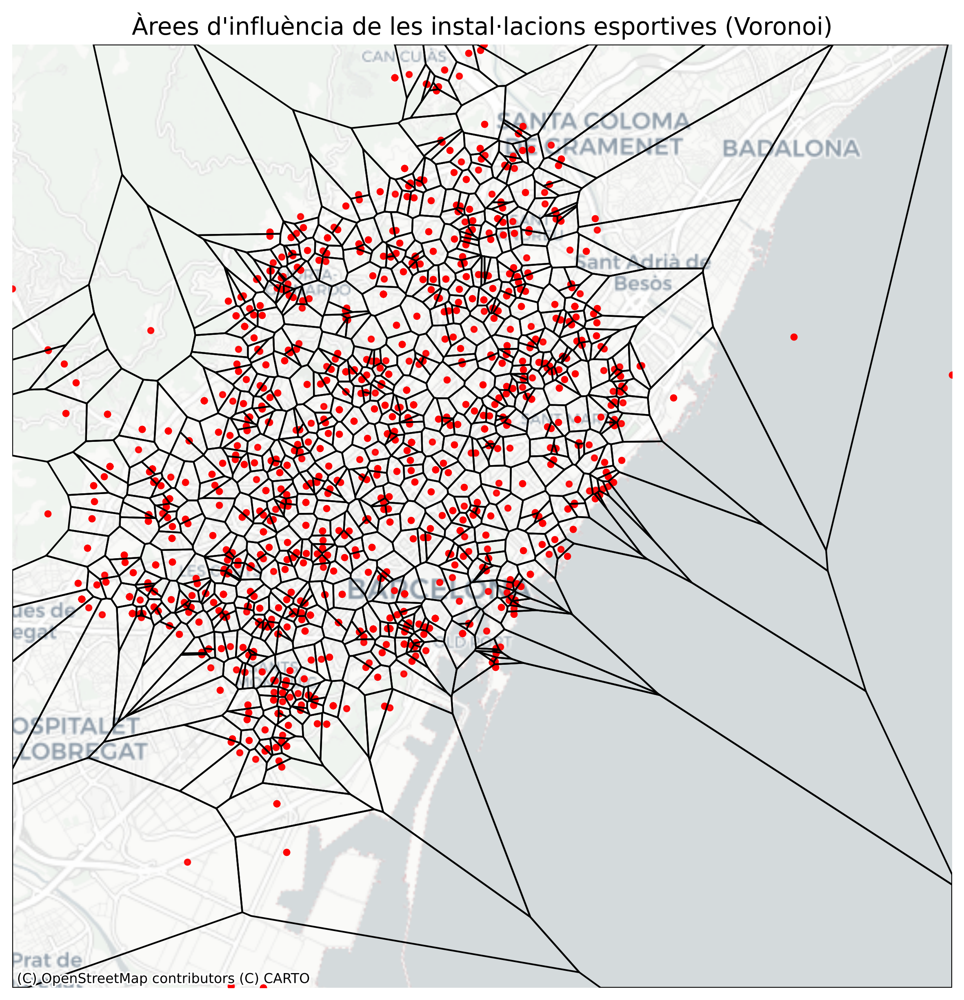
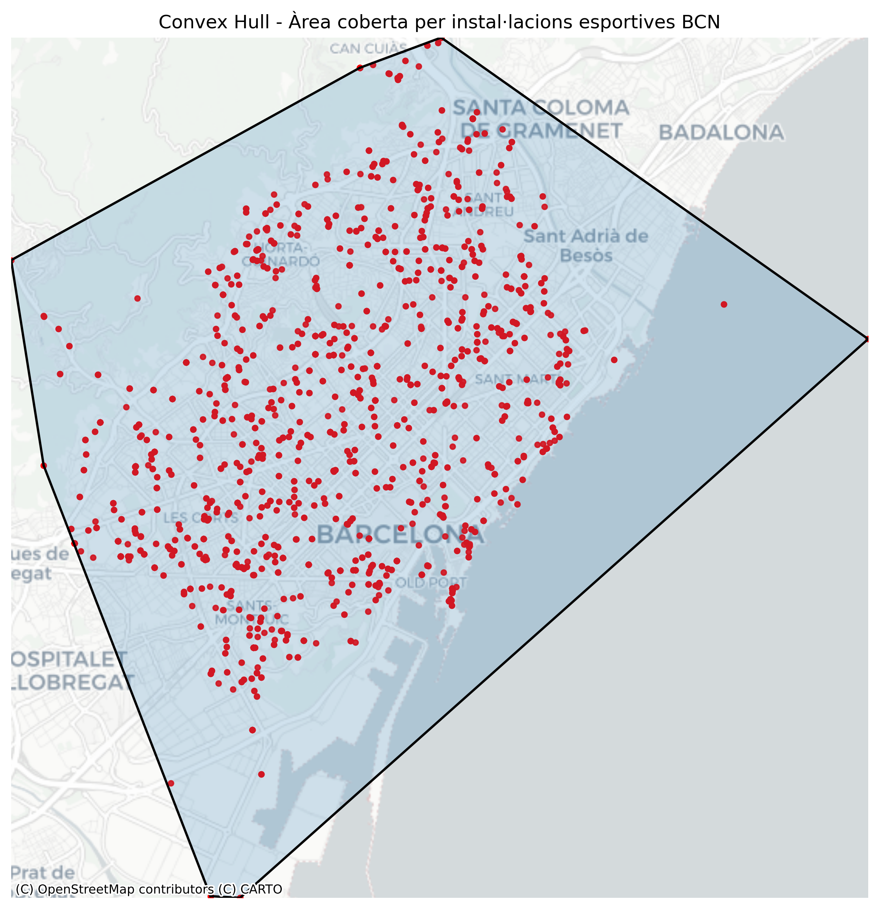

# PR2_Vizualitzaci-_Dades

## Descripció
Aquest projecte forma part de la PAC2 de l’assignatura de Visualització de Dades. L’objectiu és explorar i aplicar diferents tècniques de visualització utilitzant dades reals.

---

## Objectiu
Aplicar tres tècniques de visualització:
- Pie Chart
- Voronoi Diagram
- Convex Hull

---

## Tècniques utilitzades

### Pie Chart
Representa la distribució de les fonts d’energia a Espanya (2024).

### Voronoi Diagram
Divideix l’espai en àrees d’influència segons la proximitat a instal·lacions esportives.

### Convex Hull
Mostra l’àrea mínima que engloba totes les instal·lacions esportives.

---

### Dades utilitzades
- Dades energètiques: INE (Espanya)
- Instal·lacions esportives: Open Data Barcelona

---

## Instal·lació
Instal·lar dependències:

```bash
pip install -r requirements.txt
````
---

## Resultats

### Pie Chart
<p align="center">
  
</p>

### Voronoi
<p align="center">
  
</p>


### Convex Hull
<p align="center">
    
</p>

